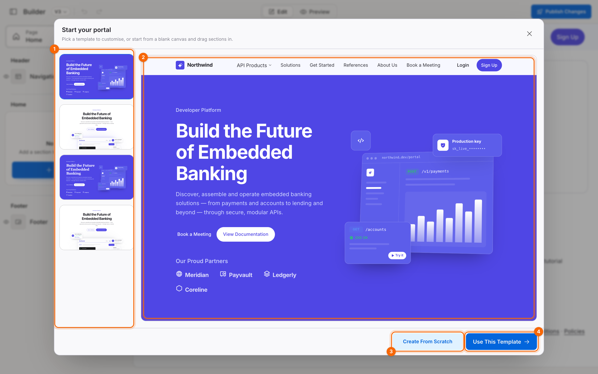
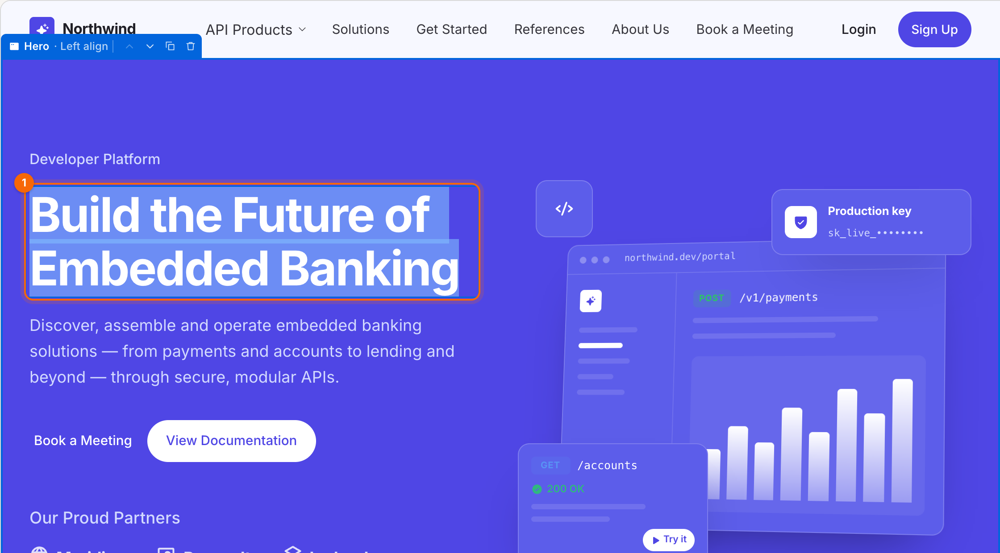
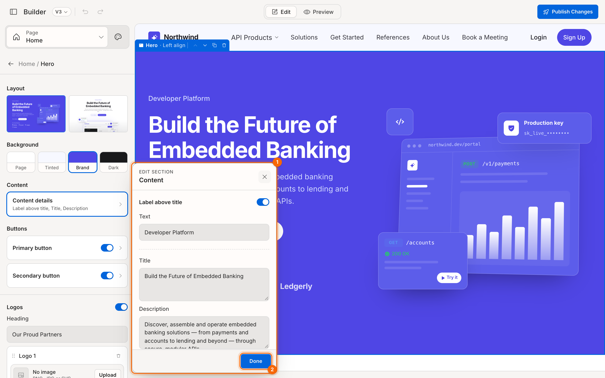

# Tutorial: build your first portal

In this tutorial you'll go from an empty builder to a branded portal home page, then check it on a phone and publish it. It takes about ten minutes. You don't need to know anything about the builder yet. Follow the steps in order, and each one shows you what to expect.

**You'll learn to:** pick a template, edit text, change a section's look, add a section, set your brand colour, preview and publish.

## 1. Open the builder

In the portal's left rail, click **Customise**. The first time you do this, the builder asks how you'd like to start.

## 2. Pick a template

1. On the left you'll see four templates (1). Click each one and the large preview (2) shows the whole page it creates.
2. Choose **Full portal**. It includes every kind of section, which makes it the best one to learn with.
3. Click **Use This Template** (4).

The template picker closes and you're in the builder, with the template's sections already on the page.

> **Tip:** **Create From Scratch** (3) gives you just a navigation bar and footer, with an empty page in between. You'll use that once you know your way around.

## 3. Change the headline

The large text at the top of the page belongs to the **Hero** section.

1. On the canvas, **double-click** the headline *Build the Future of Embedded Banking*. The text becomes editable.
2. Type your own headline, for example *Build on Acme's payment APIs*.
3. Click anywhere outside the text to finish. (In multi-line text like this headline, **Enter** starts a new line. **Esc** cancels your edit.)

Your change is saved straight away. There's no Save button.

## 4. Edit the Hero section's details

1. In the section list on the left, click **Hero**. The panel now shows everything you can change about the Hero, and the Hero is outlined on the canvas.
2. Under **Content**, click **Content details**. A small editing window (a *popup*) opens beside the panel.
3. Change the **Description** text and watch the canvas update as you type.
4. Click **Done**.

## 5. Change the Hero's look

Still in the Hero settings:

1. Under **Layout**, click the second card. The Hero switches to a centred layout, and to the white **Page** background that layout was designed for.
2. Under **Background**, click **Tinted**. The Hero now sits on a light tint of your brand colour.

Try a few combinations. Undo (**⌘Z** on Mac, **Ctrl+Z** on Windows) steps back through every change.

## 6. Add a section

1. Click the back arrow (**←**) at the top of the panel to return to the section list.
2. On the canvas, hover between two sections. A blue **Add section** button appears. Click it.
3. In the library that opens, click **FAQ**. A FAQ section is added at that spot and opened for editing.

## 7. Set your brand colour

1. At the top of the panel, click the palette icon to open **Themes & Typography**.
2. In **Brand colour**, type your colour's hex code, for example `#0f766e`.

Every button, link, tint and highlight on the page updates to match.

## 8. Preview on a phone

1. In the top bar, click **Preview**. The panel disappears and the page fills the screen, as a visitor would see it.
2. Click the phone icon in the top right to see the mobile layout.
3. Click **Edit** to go back.

## 9. Publish

Click **Publish Changes** in the top bar. A confirmation message tells you your changes are published.

## What you've done

You picked a template, edited text on the canvas and in a popup, changed a section's layout and background, added a section, set a brand colour, previewed on mobile and published.

**Next steps**
- Set up your links in [Navigation and footer](05-navigation-and-footer.md).
- Make the portal yours with [Brand and appearance](07-brand-and-appearance.md) and [Typography](08-typography.md).
- See everything you can add in [Section types](11-reference-section-types.md).
