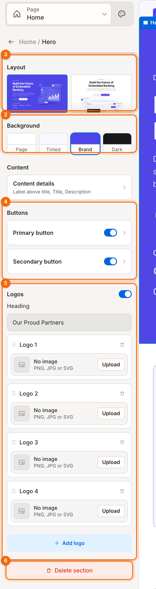

# Edit a section

Each section has a **layout**, a **background** and **content**: its text, buttons, images and lists. You can edit all of it in the panel, or directly on the canvas.

1. **Layout**: different arrangements of the same content.
2. **Background**: the surface the section sits on.
3. **Content**: the section's text, opened in a popup.
4. **Buttons**: switch each button on or off, and set its label and link.
5. **Lists**: repeating items such as logos, steps or questions.
6. **Delete section**

The groups you see depend on the section type. [Section types](11-reference-section-types.md) lists them all.

## Open a section's settings

Click the section in the section list, or click it on the canvas.

## Change the layout

Under **Layout**, click a card. Hover a card to see the layout's name.

> **Note:** some layouts are designed for a particular background. Choosing one of those switches the background too, and you can change it straight back.

Fields that only apply to one layout appear when you choose it. For example, the Awards table layout adds **Highlight cards**.

## Change the background

Under **Background**, pick one:

| Option | What it looks like |
|---|---|
| **Page** | The page's normal background (white in light mode) |
| **Tinted** | A light tint of your brand colour |
| **Brand** | Your brand colour at full strength, with light text |
| **Dark** | A near-black surface, with light text |

Text and buttons switch colour automatically to stay readable on each one.

## Edit text

**On the canvas (quickest)**
1. **Double-click** any text on the canvas.
2. Type. In single-line text, **Enter** finishes. In multi-line text, click outside to finish.
3. Press **Esc** to cancel your edit.

**In a popup**
1. Click a group card, for example **Content details**. A popup opens beside the panel.
2. Edit the fields. The canvas updates as you type.
3. Click **Done**, press **Esc**, or click outside the popup.

1. **Popup**: its title shows what you're editing.
2. **Done**

> **Tip:** clicking something on the canvas opens the popup for it straight away. For example, click a button on the canvas to open that button's label and link.

## Show, hide and edit buttons

Under **Buttons**, use the switch on a button's card to show or hide it on the page. Click the card itself to edit its **Label** and **Link**.

Links can be a full address (`https://…`), a page on your portal (`/docs`) or a place on the page (`#pricing`).

## Show a small label above the title

Many sections can show a short label above their title, for example *Developer Platform*. In **Content details**, switch on **Label above title** and type its **Text**.

## Edit a list

Lists are repeating items: logos, steps, questions, articles, features.

- **Add an item**: click **Add …** under the list (for example **Add logo**). Some lists have a maximum, such as 4 steps. The add button turns off when you reach it.
- **Edit an item**: click its card to open it in a popup.
- **Duplicate**: click ⧉ on the card. The copy appears below the original.
- **Delete**: open the item and click **Delete** at the bottom of its popup. Logo cards also have a 🗑 icon.

> **Note:** list items can't be reordered yet. The ⋮⋮ handle on each card is there for a planned drag-to-reorder. To change the order, edit the items' content instead.

## Add images and logos

Where a field accepts an image (a logo, an illustration, a cover image), click **Upload** and choose a PNG, JPG or SVG file. Until you upload one, the section shows its built-in artwork or icon.

**Related:** [Manage sections](03-manage-sections.md) · [Section types](11-reference-section-types.md)
