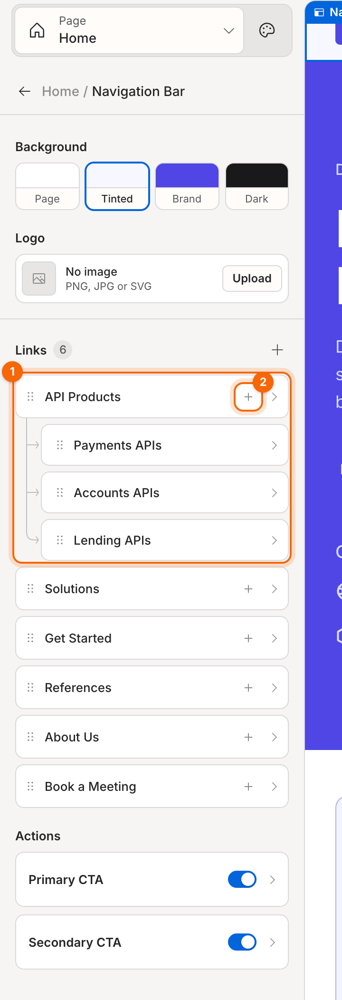
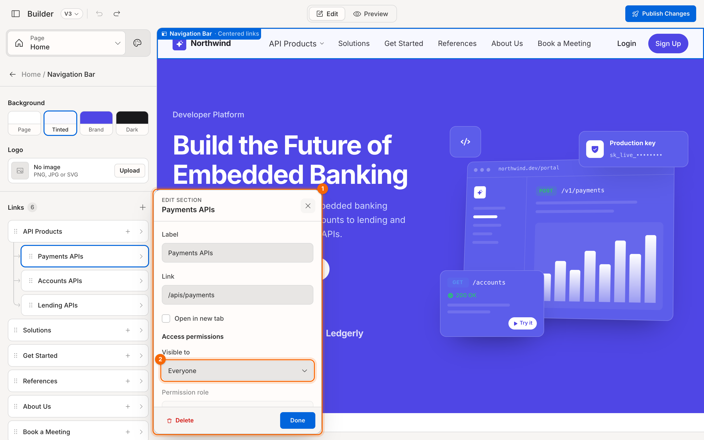

# Navigation and footer

The navigation bar and footer are shared: they appear on every page that has site navigation (Home and Contact us), so you set them up once. Both sit in the section list under **Header** and **Footer**.

## Set up the navigation bar

1. In the section list, click **Navigation Bar**.
2. Set its **Background** and upload a **Logo** (PNG, JPG or SVG).
3. Edit the links under **Links**.

1. **A link with a dropdown**: its items are shown beneath it, joined by connector lines.
2. **Add a dropdown item (+)**

### Add, edit and remove links

- **Add a link**: click **+** next to **Links**. The navigation bar holds up to **7** links.
- **Edit a link**: click it to open its popup, then set **Label** and **Link**. Tick **Open in new tab** for external sites.
- **Delete a link**: open it and click **Delete**.

### Make a dropdown menu

1. Click **+** on a link's row. A dropdown item is added under it, and the link becomes a menu.
2. Click the new item to set its label and link. A dropdown holds up to **8** items.

> **Note:** a link with a dropdown opens its menu instead of going somewhere, so its own **Link** field is hidden.

### Choose who sees a link

Every link, dropdown item, **Login link** and **Sign-up button** has **Access permissions**:

1. **Link popup**
2. **Visible to**

| Visible to | Shown to |
|---|---|
| Everyone | All visitors (default) |
| Logged-in users only | Signed-in visitors |
| Logged-out users only | Visitors who aren't signed in, for example a "Sign up" link |
| Specific permission role | Users with the **Permission role** you pick: Administrator, Developer, Partner or Viewer |
| Specific user group | Users in the **User group** you pick: Internal team, Partners, Customers or Beta testers |

**Permission role** and **User group** become available once you pick the matching **Visible to** option. On the canvas, a restricted link shows a small lock icon. Hover it to see who the link is for.

### Login and sign-up actions

Under **Actions**, switch **Login link** and **Sign-up button** on or off, and click each to set its label, link and permissions.

## Set up the footer

1. In the section list, click **Footer**.
2. Edit the **About title** and **About text**: a short description of your company.
3. Add **Social icons**: pick an icon and a label for each.
4. Edit **Link columns** (up to **4**). Click a column to rename it, and click **+** on a column to add a link to it.
5. Edit the **Legal line** (for example *© 2026 Acme Inc.*) and the **Legal links** (Privacy, Terms…).

## Hide the navigation bar or footer

Click the eye icon on the **Navigation Bar** or **Footer** row. Hiding keeps everything you've set up, so click the eye again to show it.

**Related:** [Manage pages](06-manage-pages.md) · [Interface reference](10-reference-interface.md)
