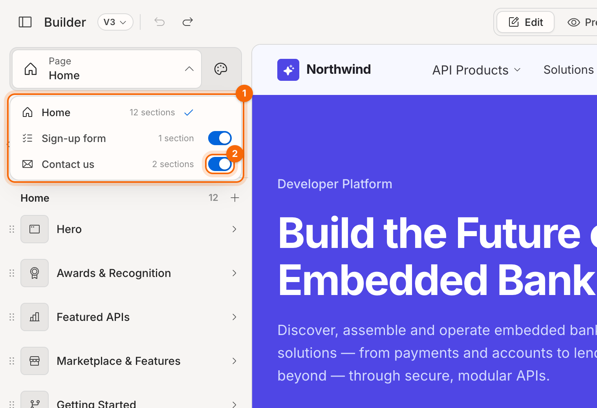
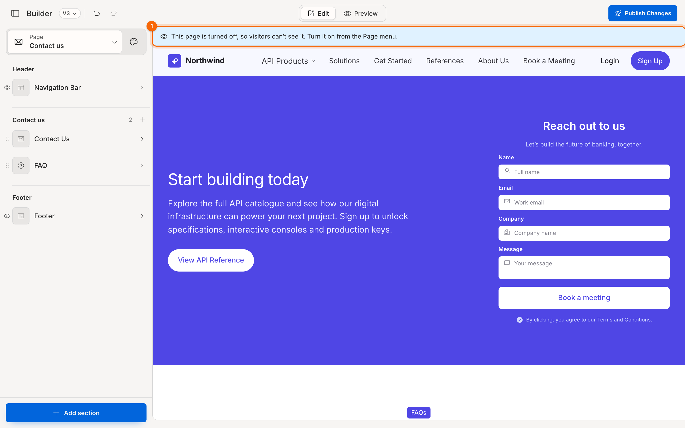
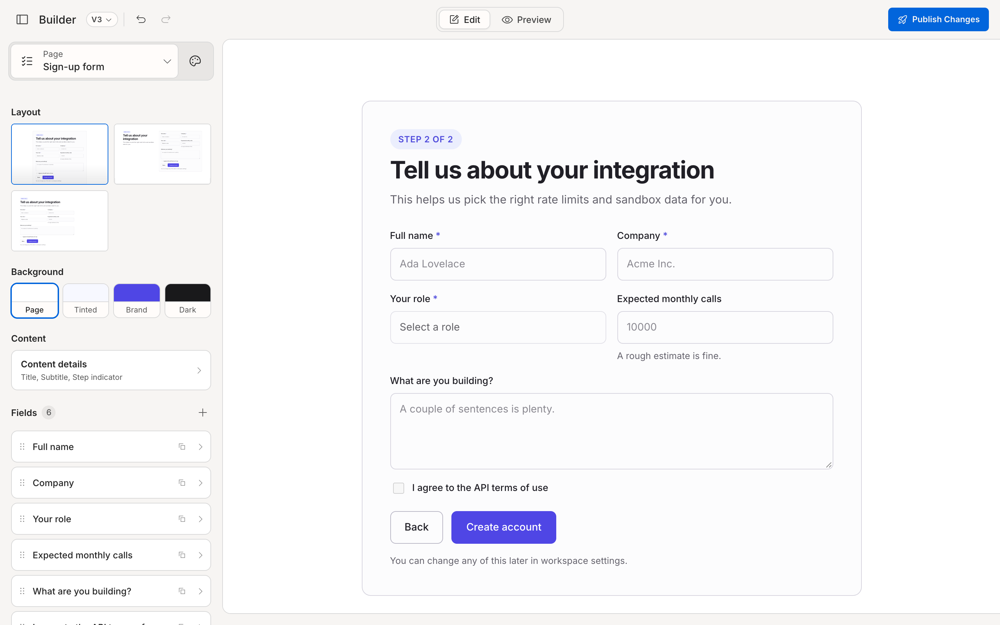

# Manage pages

Your portal has three pages you can design in the builder:

| Page | What it is | What you can change |
|---|---|---|
| **Home** | Your portal's front page | Any sections from the full library, plus the shared navigation bar and footer |
| **Sign-up form** | The form new developers fill in to get access | One fixed form: its title, fields and buttons. No navigation bar or footer |
| **Contact us** | A page for enquiries | Contact, FAQ, Trusted Partners, References and Resources sections, plus the shared navigation bar and footer |

Pages can't be renamed or deleted, but every page except Home can be turned off.

## Switch to another page

1. At the top of the panel, click **Page** (it shows the current page's name).
2. Pick a page from the menu. Each one shows how many sections it has, and a ✓ marks the page you're on.

1. **Page menu**
2. **On/off switch**

## Turn a page off or on

Turn a page off when it isn't ready, or when you don't need it. Its content is kept.

1. Click **Page** to open the menu.
2. Click the switch next to **Sign-up form** or **Contact us**. Turned-off pages show **Off**, with their name greyed out.

While you're on a page that's off, a banner across the top of the canvas reminds you that visitors can't see it.

> **Note:** **Home** can't be turned off. It's the first page every visitor lands on.

You can undo turning a page on or off, like any other change.

## Edit the sign-up form

The **Sign-up form** page is a single form, so choosing it opens the form's settings straight away. There's no section list.

- **Layout**: centred card, copy beside the form, or plain full width.
- **Content details**: the title, subtitle and **Step indicator** (shows the form as a step in a longer sign-up flow, such as *Step 2 of 2*).
- **Fields**: click **+** to add a field, then click it to set its label, placeholder, type (Single line, Email, Paragraph, Dropdown, Checkbox, Radio group, Number or Date), choices for dropdowns and radio groups (comma separated), helper text, **Required** and **Full width**. Duplicate a field with ⧉.
- **Actions**: the submit button, an optional back button and a footnote.

**Related:** [Navigation and footer](05-navigation-and-footer.md) · [Section types](11-reference-section-types.md)
