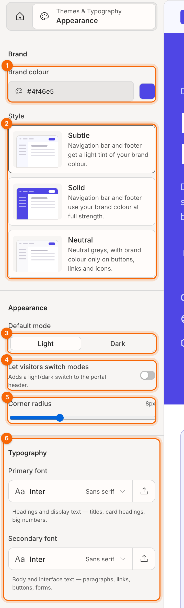
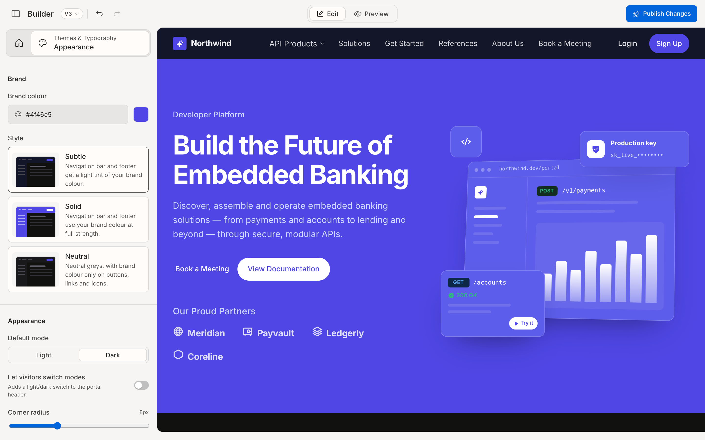

# Brand and appearance

Your brand colour and a few appearance settings drive the look of the whole portal: every page and every section. Open them from the palette icon at the top of the panel (**Themes & Typography**).

1. **Brand colour**
2. **Style**: how strongly the brand colour shows on the navigation bar and footer.
3. **Default mode**: light or dark.
4. **Let visitors switch modes**
5. **Corner radius**
6. **Typography**: see [Typography](08-typography.md).

## Set your brand colour

Type a hex code (for example `#0f766e`) in **Brand colour**, or click the colour square to pick one.

From that one colour, the builder works out a full set of matching shades for backgrounds, tints, borders, buttons and links. It checks them for contrast, so text stays readable. You never pick those shades by hand.

> **Tip:** use your brand's main colour as it appears on your logo or buttons. If it's very light (like a pale yellow), buttons get dark text automatically.

## Choose a style

**Style** decides how much of your brand colour appears on the shared navigation bar and footer:

| Style | Navigation bar and footer |
|---|---|
| **Subtle** | A light tint of your brand colour (default) |
| **Solid** | Your brand colour at full strength. Buttons on them switch colour to stay visible |
| **Neutral** | Neutral greys. Brand colour only on buttons, links and icons |

Each option shows a small preview in your current colour.

## Choose light or dark mode

Under **Default mode**, pick **Light** or **Dark**. This is the mode visitors see first.

### Let visitors switch

Switch on **Let visitors switch modes** to add a light/dark toggle to your portal's header (the moon icon). Visitors start in your default mode and can change it, and their choice is remembered.

## Set the corner radius

Drag **Corner radius** (0 to 24 px) to make cards, buttons and inputs sharper or rounder across the whole portal.

**Related:** [Typography](08-typography.md) · [How the builder works](12-explanation-how-the-builder-works.md)
