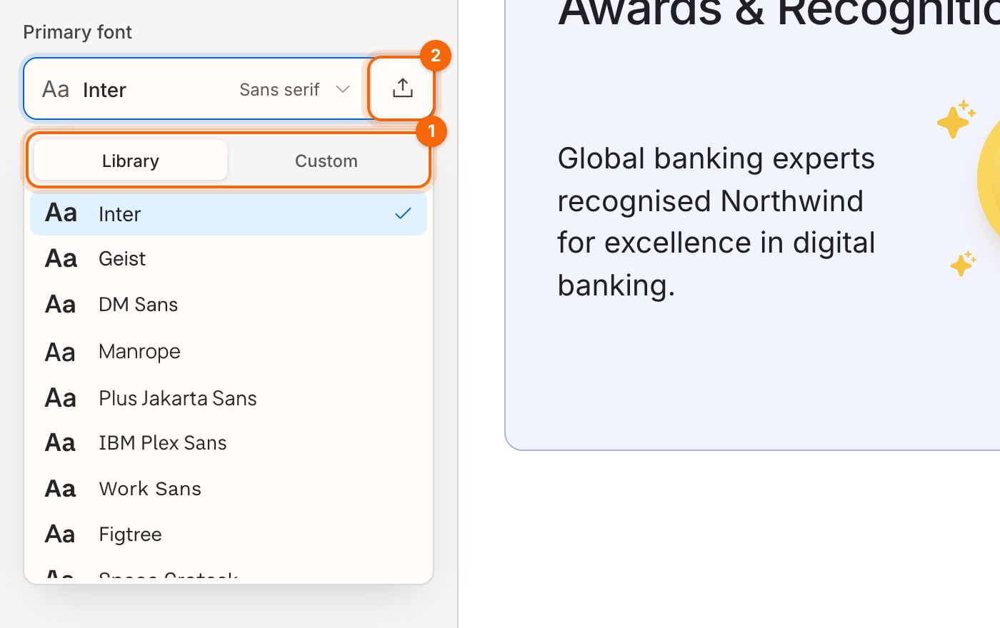

# Typography

Your portal uses two fonts:

- **Primary font**: headings and display text, such as titles, card headings and big numbers.
- **Secondary font**: body and interface text, such as paragraphs, links, buttons and forms.

Both are in **Themes & Typography**, under **Typography**.

## Choose a font

1. Click the **Primary font** or **Secondary font** box. The font menu opens on the **Library** tab.
2. Pick a font. Each one is shown in its own typeface, and the canvas updates straight away.

1. **Library / Custom**: switch between built-in fonts and fonts you've uploaded.
2. **Upload**

**Built-in fonts**

| Kind | Fonts |
|---|---|
| Sans serif | Inter (default), Geist, DM Sans, Manrope, Plus Jakarta Sans, IBM Plex Sans, Work Sans, Figtree |
| Display | Space Grotesk, Sora, Outfit, Poppins |
| Serif | Fraunces, Playfair Display, Lora, Source Serif 4 |
| System | System UI (the visitor's device font) |

## Upload your own font

1. Click the upload icon next to the font box.
2. Choose a font file: **.woff2**, **.woff**, **.ttf** or **.otf**.
3. The font is applied straight away, and stays available under the **Custom** tab for both font roles.

> **Tip:** use **.woff2** where you can. It's the smallest, so your portal loads faster. Make sure your font licence allows use on the web.

## Pairing advice

- One font for everything (for example Inter + Inter) is the safest, cleanest choice.
- For more character, pair a **Display** or **Serif** primary font with a **Sans serif** secondary font, for example Fraunces + Inter.
- Avoid two different decorative fonts. Body text needs to stay easy to read.

**Related:** [Brand and appearance](07-brand-and-appearance.md)
