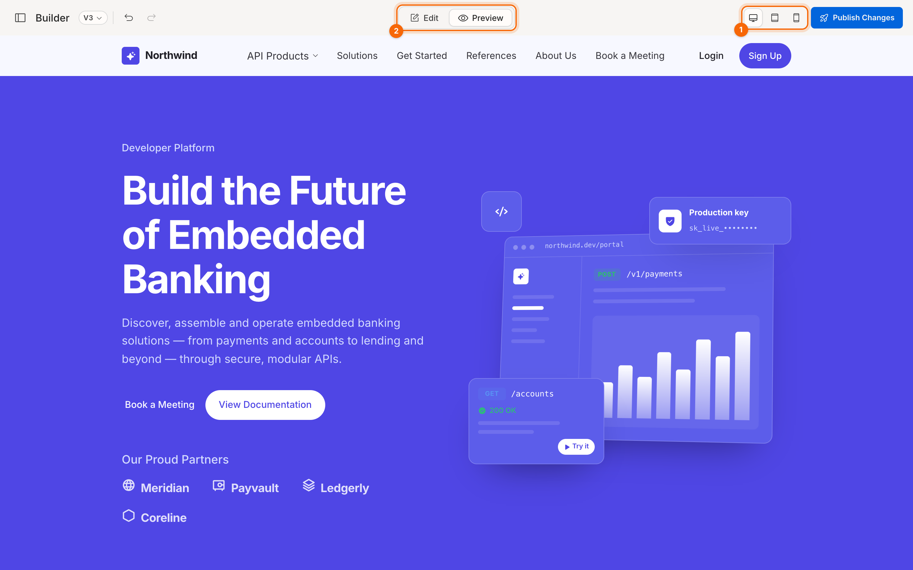
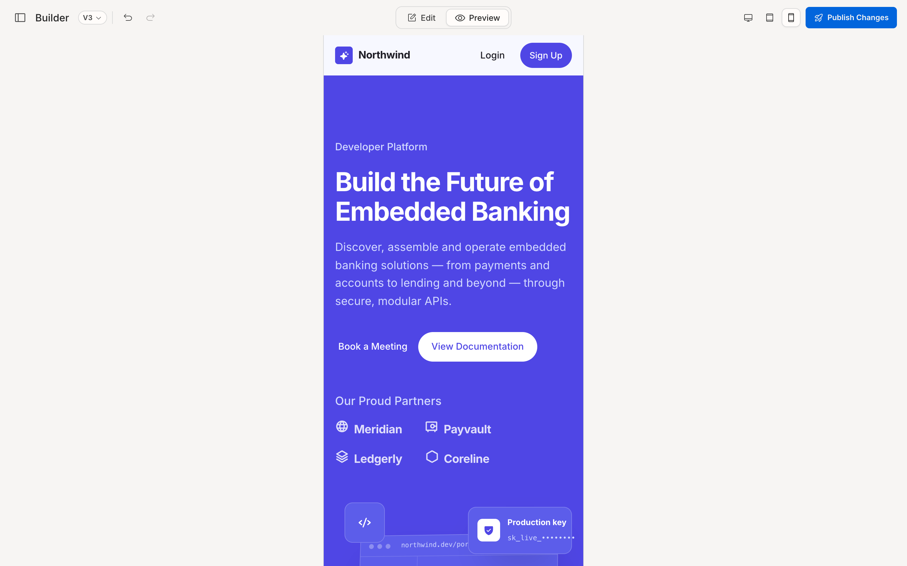
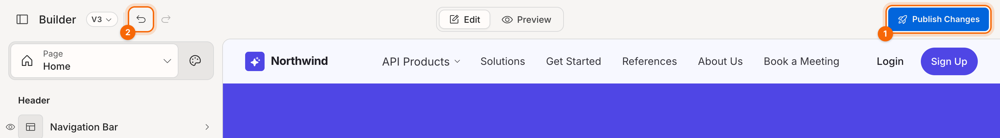

# Preview and publish

## Preview your portal

1. In the top bar, click **Preview**. The panel and editing outlines disappear, and you see the page as visitors will.
2. Use the device buttons to check the layout on **Desktop**, **Tablet** and **Mobile**.
3. Click **Edit** to go back to editing.

1. **Device switch**
2. **Edit / Preview**

> **Tip:** links and buttons are live in Preview, so you can open dropdown menus and check the navigation works.

## Undo and redo

Every change can be undone: text, layouts, colours, deletions, pages turned on or off.

| | Mac | Windows |
|---|---|---|
| Undo | **⌘Z** | **Ctrl+Z** |
| Redo | **⇧⌘Z** | **Ctrl+Shift+Z** |

You can also use the arrow buttons next to **Builder** in the top bar. Fast typing in one field counts as a single step, so one undo takes back the whole word or sentence.

## Saving

There's no Save button. Every change is saved as you make it.

## Publish

When you're happy with the result, click **Publish Changes** in the top bar. A message confirms your changes are published.

1. **Publish Changes**
2. **Undo**

> **Check before you publish:** preview on mobile, check pages you've turned off are meant to be off, and click through your navigation links.

**Related:** [Interface reference](10-reference-interface.md)
